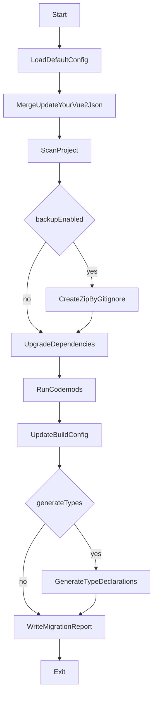

# Vue2 升级到 Vue3 的 Node.js CLI 方案

## 目标与约束

- **命令**: `update-your-vue2`（支持 `npm i -g`、`npx update-your-vue2`、以及本地 `./node_modules/.bin/update-your-vue2`）
- **配置**: 内置默认配置；项目根目录可用 `update-your-vue2.json` 覆盖。
- **配置项（至少）**:
  - `generateTypes`: 是否自动生成 TS 类型声明
  - `useCompat`: 是否使用 `vue@compat`
  - `backup`: 是否备份（默认启用）
  - `backupDir`: 备份输出目录（默认建议 `.update-your-vue2/backups/`）
- **备份行为**:
  - 在运行改动前备份
  - 依据 `.gitignore` 过滤备份内容（并补充默认忽略：`node_modules/`, `dist/`, `coverage/`, `.git/` 等）
  - 输出为 `项目名称-时间戳.zip`
- **升级范围**: 同时支持 **vue-cli(webpack)** 与 **自建 webpack**（先实现通用依赖升级 + codemod，再分别处理构建配置差异）。

## 仓库/包结构（从零开始）

- `[package.json](/Users/john/codes/update-your-vue2/package.json)`
  - `name`: `update-your-vue2`
  - `bin`: `{ "update-your-vue2": "./dist/cli.js" }`
  - `type`: `commonjs` 或 `module`（建议 `commonjs` 以兼容更多 Node 环境）
- `[src/cli.ts](/Users/john/codes/update-your-vue2/src/cli.ts)`: 命令行入口（参数解析、交互、日志、错误码）
- `[src/config/defaultConfig.ts](/Users/john/codes/update-your-vue2/src/config/defaultConfig.ts)`: 默认配置
- `[src/config/loadConfig.ts](/Users/john/codes/update-your-vue2/src/config/loadConfig.ts)`: 读取/校验/合并 `update-your-vue2.json`
- `[src/backup/backupProject.ts](/Users/john/codes/update-your-vue2/src/backup/backupProject.ts)`: 依据 `.gitignore` 打包 zip
- `[src/plan/scanProject.ts](/Users/john/codes/update-your-vue2/src/plan/scanProject.ts)`: 探测项目类型（vue-cli vs custom webpack）、读取 `package.json`、锁文件、关键配置文件
- `[src/migrate/migrateDeps.ts](/Users/john/codes/update-your-vue2/src/migrate/migrateDeps.ts)`: 依赖升级与兼容包策略
- `[src/migrate/codemods/*](/Users/john/codes/update-your-vue2/src/migrate/codemods/)`: 代码转换（JS/TS/Vue SFC）
- `[src/report/report.ts](/Users/john/codes/update-your-vue2/src/report/report.ts)`: 迁移报告（做了什么、需要人工处理什么）

## 关键依赖选择（建议）

- **CLI**: `commander`（或 `yargs`）
- **配置校验**: `zod`
- **文件匹配/遍历**: `fast-glob`
- **.gitignore 解析**: `ignore`
- **zip**: `archiver`（流式写 zip，适合大项目）
- **codemod**:
  - JS/TS AST: `jscodeshift` + `recast`（或 `ts-morph` 用于 TS-heavy）
  - Vue SFC: `@vue/compiler-sfc`（解析 `.vue` 的 `<script>`/`<script setup>` 等）

## 运行流程（高层）

## 迁移实现分阶段（可迭代交付）

- **Phase A: 可用的 CLI + 配置 + 备份**
  - 参数：`--config`, `--dry-run`, `--no-backup`, `--use-compat`, `--generate-types`, `--backup-dir`, `--verbose`
  - `dry-run` 只输出“计划改动/将备份哪些文件/将升级哪些依赖”，不写盘
- **Phase B: 依赖升级（安全、可回滚）**
  - 读取 `package.json`，根据 `useCompat` 切换策略：
    - `useCompat=false`: 升级到 Vue3 生态（如 `vue@^3`, 对应 router/store 等按检测规则升级）
    - `useCompat=true`: `vue@compat` + `@vue/compat` 配置提示
  - 支持 npm/yarn/pnpm（通过检测 lockfile 决定安装命令；也允许只改 `package.json` 不自动 install）
- **Phase C: 代码转换（codemods）**
  - JS/TS：常见 API 迁移（可配置开关），输出“无法自动转换清单”
  - `.vue`：用 `@vue/compiler-sfc` 拆出 script 块再走 AST
  - 每个 codemod 单独可运行，便于回归与跳过
- **Phase D: 构建配置迁移**
  - vue-cli：优先处理 `vue.config.js`、`babel`/`postcss` 配置差异
  - custom webpack：扫描 `webpack*.js`/`build/` 目录，做最小可行变更并产出人工步骤
- **Phase E: 类型声明生成（可选）**
  - 若项目已 TS：跑 `tsc --declaration --emitDeclarationOnly`（或使用项目既有脚本）
  - 若非 TS：只生成必要的 shim（例如 `shims-vue.d.ts`）+ 报告提示（受配置控制）

## 验证与安全

- 任何写操作前：若 `backup=true`，先成功产出 zip；失败则中止
- 所有写操作集中在一个“变更队列”，便于 `dry-run` 与回滚
- 输出 `migration-report.md/json`（包含：变更、手工 TODO、依赖升级摘要、失败的 codemod 位置）

## 预期交付物

- 一个可安装运行的 CLI 包
- 默认配置 + `update-your-vue2.json` 覆盖
- 备份 zip（respect `.gitignore`）
- 迁移管线骨架 + 第一批依赖升级规则与 codemods（可持续扩展）

