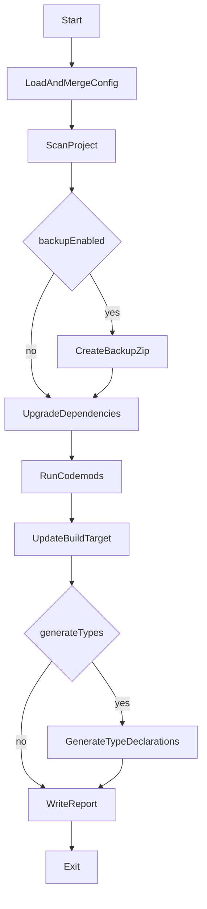

# Vue2 升级到 Vue3 的 Node.js CLI（update-your-vue2）设计文档

日期：2026-03-19

## 背景与目标

我们要开发一个基于 Node.js 的 CLI 工具 `update-your-vue2`，用于将 **Vue2 项目升级到 Vue3**。工具既支持 `npm i -g` 全局安装，也支持 `npx update-your-vue2` 和项目本地 `./node_modules/.bin/update-your-vue2` 运行。

本工具的核心目标是：**可控、可回滚、可迭代覆盖更多项目形态**。因此采用“分阶段 + dry-run + 变更队列 + 报告”的策略，而不是一次性激进全自动改写所有内容。

## 适用范围（第一阶段）

- **输入项目**：
  - Vue2 + vue-cli（webpack）项目
  - Vue2 + 自建 webpack 项目
  - 可能包含 JS / TS / Vue SFC
- **输出目标**：
  - 默认：**Vue3 + Vite**（`target=vite`）
  - 可选：Vue3 + webpack（`--target webpack`）
- **迁移策略默认值**：
  - 默认 **不走 compat**（直升纯 Vue3）
  - 可选 `--use-compat` 走 `vue@compat`

## 非目标（第一阶段不保证）

- 100% 自动完成所有业务相关改造（例如复杂的自定义 webpack 插件链、深度耦合的 UI 框架升级等）
- 自动保证“升级后立刻编译通过并运行正确”（工具会尽量自动化，并产出报告和人工清单）

## CLI 形态

### 命令

- `update-your-vue2 [projectRoot]`
  - 默认 `projectRoot=process.cwd()`
- `update-your-vue2 restore [projectRoot]`
  - 从历史备份 zip 中选择一个并还原到项目目录
  - 默认 `projectRoot=process.cwd()`

### 推荐参数（MVP）

- `--config <path>`：指定配置文件路径（默认寻找 `<projectRoot>/update-your-vue2.json`）
- `--dry-run`：只输出计划，不写盘
- `--target <vite|webpack>`：构建目标（默认 `vite`）
- `--use-compat`：启用 `vue@compat`
- `--generate-types`：启用类型声明生成（默认受配置控制）
- `--backup / --no-backup`：是否备份（默认备份）
- `--backup-dir <path>`：备份输出目录（默认 `.update-your-vue2/backups/`）
- `--install / --no-install`：是否执行安装命令
  - **默认：不自动 install**（需要显式 `--install`）
- `--verbose`：更详细的日志输出

### restore 子命令（MVP）

`restore` 专注于从备份中恢复项目内容，以便在迁移失败或需要回滚时快速还原。

- **交互与选择**
  - 默认扫描 `backupDir`（默认 `.update-your-vue2/backups/`）下的 `*.zip`
  - 按时间戳/文件 mtime 排序，提供交互式选择（或通过参数直指定）
- **建议参数**
  - `--backup-dir <path>`：备份目录（与主命令一致）
  - `--zip <path>`：直接指定要恢复的 zip（指定后跳过交互选择）
  - `--dry-run`：只展示将要覆盖/创建/删除的文件，不实际写盘
  - `--force`：跳过安全确认（默认会提示“将覆盖现有文件”）
- **还原策略（安全优先）**
  - 默认只“解压覆盖/创建”文件，不主动删除备份中不存在的文件（避免误删迁移过程中新增的内容）
  - 解压前进行安全检查：拒绝 zip 中包含 `..` 或绝对路径的条目（防止 Zip Slip）
  - 还原前建议先自动创建一次“当前项目状态”的备份（可通过参数关闭），保证可二次回滚

### 退出码约定

- `0`：执行成功（或 dry-run 成功）
- `1`：执行失败（备份失败、配置无效、变更应用失败等）

## 配置体系

### 配置来源与优先级

优先级从高到低：

1. CLI flags
2. 配置文件（默认 `<projectRoot>/update-your-vue2.json`，可用 `--config` 指定）
3. 内置默认配置

### 配置文件格式

文件名：`update-your-vue2.json`

最小配置项（第一阶段）：

- `generateTypes: boolean`
- `useCompat: boolean`
- `backup: boolean`
- `backupDir: string`
- `target: "vite" | "webpack"`
- `install: boolean`

工具会对配置做结构校验（无效配置直接失败并输出错误原因）。

## 备份设计（zip + respect .gitignore）

### 触发时机

只要即将执行写盘操作（非 dry-run）且 `backup=true`，**必须先完成备份**。备份失败则中止迁移，避免破坏项目。

### 备份范围

- 以项目根目录为基准
- 使用 `.gitignore` 规则过滤（并补充内置默认忽略）：
  - `.git/`
  - `node_modules/`
  - `dist/`
  - `coverage/`
  - 以及备份输出目录自身（防止递归）

### 备份产物

输出目录：默认 `.update-your-vue2/backups/`

文件名：`<项目名>-<时间戳>.zip`

其中项目名优先取 `package.json.name`，否则取目录名。

## 迁移管线（分阶段）

### 总体流程

### 变更队列（ChangeQueue）

所有将要对文件系统做的改动（写文件、改 JSON、生成新文件）都先汇总到一个队列中，使得：

- `--dry-run` 可输出“将修改什么”
- 执行时能按顺序应用，失败时定位明确
- 报告可精准描述已做的改动

### 阶段 1：项目扫描（ScanProject）

目的：识别项目类型与关键配置，作为后续步骤的输入。

应识别/收集：

- 包管理器（通过 lockfile 识别 npm/yarn/pnpm）
- `package.json`：依赖、脚本、项目名
- vue-cli 特征（如 `vue.config.js`、`@vue/cli-service` 依赖等）
- 自建 webpack 特征（如 `webpack*.js`、`build/` 目录等）

### 阶段 2：依赖升级（UpgradeDependencies）

目标：将核心依赖升级到 Vue3 生态，并根据 `target`（vite/webpack）选择不同的构建依赖方案。

要点：

- 默认直升：`useCompat=false`
- 可选 compat：`useCompat=true` 时切换为 `@vue/compat` 并在报告提示额外设置
- **默认不执行 install**：只修改 `package.json`（以及必要配置文件），并提示用户自行安装；若用户传 `--install` 才运行安装命令

### 阶段 3：代码转换（RunCodemods）

目标：对可机械化的 API 变化做自动迁移，对不确定场景输出人工 TODO。

覆盖文件：

- `.js/.ts/.jsx/.tsx`
- `.vue`（先解析 SFC，把 `<script>` 块抽出来再做 AST 转换）

原则：

- “确定性高”的做自动改
- “不确定”的只标记并写入报告（包括文件路径与定位信息）

### 阶段 4：构建目标迁移（UpdateBuildTarget）

这是差异最大的部分，因此采用保守边界：

- **能确定的自动改**
- **不确定的生成骨架 + 报告清单**
- 不尝试“推断业务特定 webpack 魔改”并强改

#### `target=vite`（默认）

- 生成 Vite + Vue3 的基础配置文件（最小可运行骨架）
- 产出“需要人工核对”的迁移清单（别名、环境变量、静态资源处理等）

#### `target=webpack`（可选）

- vue-cli：围绕 `vue.config.js` 等做适配/提示
- custom webpack：扫描 `webpack*.js`/`build/`，尽量最小改动或仅提示人工步骤

### 阶段 5：类型声明生成（GenerateTypeDeclarations，可选）

由 `generateTypes` 控制：

- 若项目已 TS：优先用项目自身 tsconfig / scripts 生成 declarations（或提供通用执行方式）
- 若项目非 TS：生成必要的 shim（例如 Vue SFC 类型声明）并在报告提示（具体策略可迭代）

### 阶段 6：报告（WriteReport）

输出 `migration-report.md`（可扩展 `migration-report.json`）包含：

- 已修改文件列表（变更摘要）
- 依赖升级摘要
- codemod 结果（成功/跳过/需要人工）
- 构建迁移清单（尤其是从 webpack → vite 的手工核对项）

## 关键决策（已确认）

- 默认构建目标：**Vite**（`target=vite`）
- 支持双模式：`--target webpack|vite`
- 默认迁移策略：**直升纯 Vue3**（`useCompat=false`）
- 可选 compat：`--use-compat`
- 默认 **不自动安装依赖**：需要显式 `--install`
- 默认启用备份：备份为 zip，respect `.gitignore`

## 验收标准（MVP）

- 能在任意目录通过 `npx update-your-vue2` 运行（全局安装也可）
- 能读取默认配置 + 项目根 `update-your-vue2.json` 并正确合并
- 非 dry-run 模式下：在任何写盘前先输出备份 zip（遵循 `.gitignore` 过滤）
- `--dry-run` 能输出将备份/将改哪些文件/将升级哪些依赖
- 迁移完成后生成报告文件，至少包含依赖升级摘要与人工 TODO 清单

